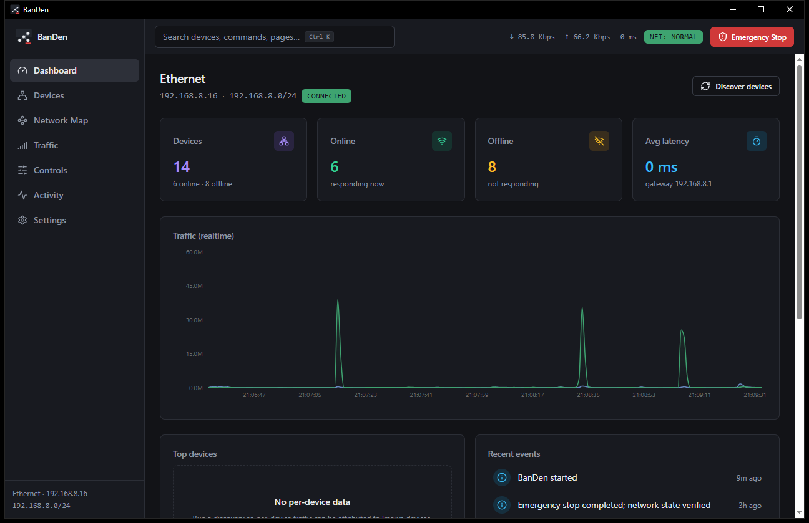
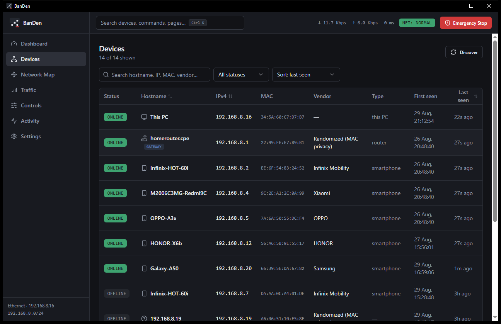
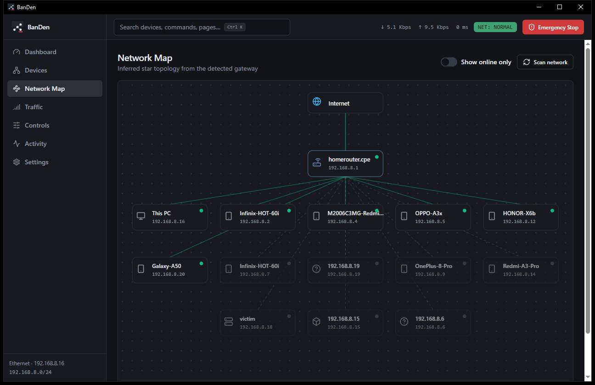
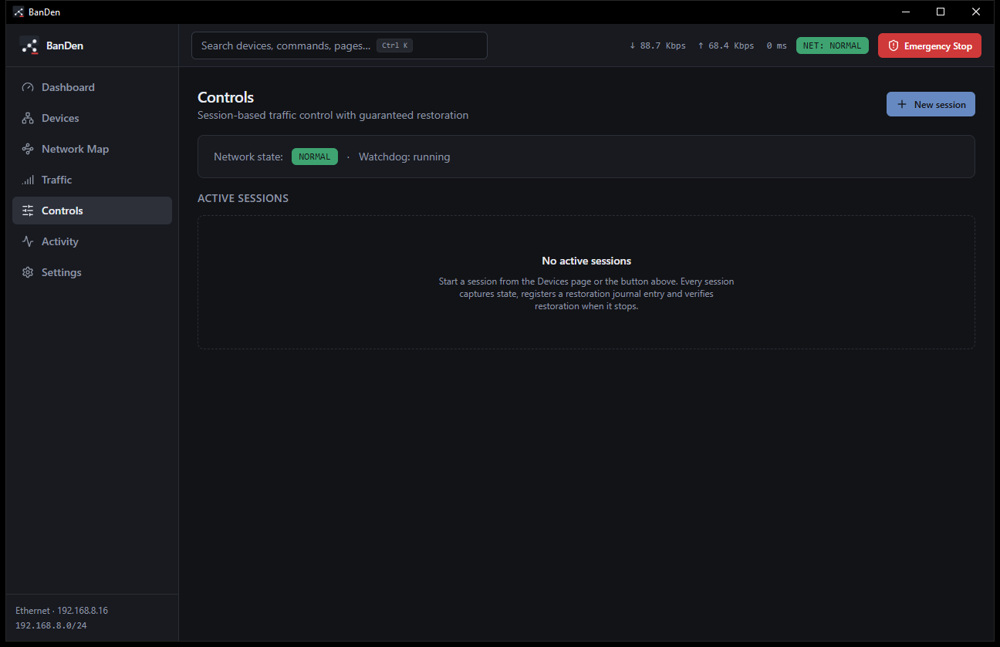
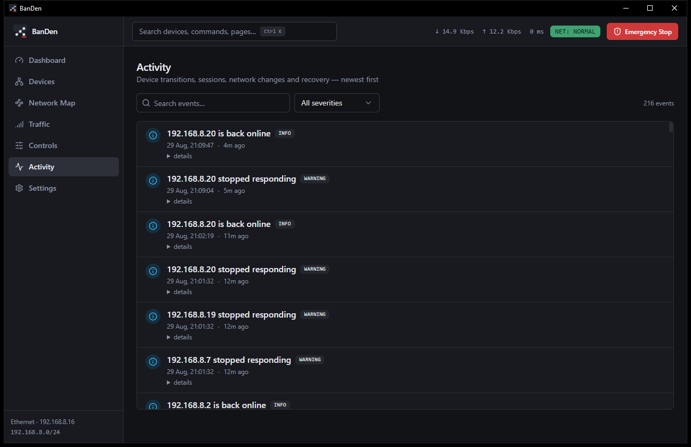

# BanDen


A native-feeling Windows desktop app to **discover, monitor and control every device on your LAN** — built with Tauri 2, Rust and React, with a safety-first session engine whose defining feature is *guaranteed restoration*.



> [!CAUTION]
> BanDen is for **authorized** network administration: your own network, home lab, family network (with consent), education and security research. Control sessions act on **real network state** (ARP-based), which is why every session captures state first, journals its undo steps, verifies restoration when it ends, and can be killed with one **Emergency Stop**.

## Why this exists

Cutting a device off the network has always meant opaque scripts or router spelunking: no preview of what happens, no restore, no per-app control, and no way to tell whether the device is actually cut. BanDen makes the same job safe and transparent:

| | Script-only approach | BanDen |
|---|---|---|
| Whole-device cut | ✅ (crude scripts) | ✅ one click, self-restores in seconds |
| Per-app cut | ❌ | ✅ WhatsApp, YouTube, TikTok, … by DNS + SNI + IP ranges |
| Allowlist mode | ❌ | ✅ invert it: ONLY the apps you pick keep internet |
| Rate limiting | ❌ | ✅ sliders + speed presets + burst priority |
| Connection-reset | ❌ | ✅ pre-existing flows die when the block starts |
| Guaranteed restore | ❌ | ✅ journaled, verified, watchdog-backed |
| Kill switch | ❌ | ✅ Emergency Stop (`Ctrl+Alt+X`) + tray |
| Device identity churn | ❌ | ✅ randomized-MAC aware discovery + auto-classification |

## Screenshots

| | |
|---|---|
|  |  |
| *Devices — kind icons, live status, per-device detail drawer* | *Network Map — inferred star topology from the gateway* |
|  |  |
| *Controls — sessions, cut / rate-limit / allowlist scopes* | *Activity — device transitions, sessions, recovery* |

## Features

- **LAN discovery** — merges the system ARP/neighbor table with a bounded, parallel `SendARP` sweep; reverse-DNS and MAC-vendor enrichment; randomized-MAC aware.
- **Device registry** — persistent SQLite-backed inventory with first/last seen, online/offline tracking, search, filter, sort and **device-kind classification** (phone, laptop, router, camera…) with manual override.
- **Real-time traffic** — per-interface counters via `GetIfEntry2` sampled once per second; bounded aggregation.
- **Npcap-backed packet inspection** — the control engine sees the target's actual traffic; per-device detail shows live reachability probes, availability % and latency history.
- **Network Map** — inferred star topology (Internet → gateway → devices) with online/offline state and a show-online-only filter.
- **Session-based control** — an explicit state machine (`Preparing → Active → Stopping → Restoring → Verifying → Completed`, plus `RecoveryRequired`/`Failed`), never a boolean flag.
  - **Whole-device cut** — the target loses internet for the session duration; corrective ARP restores it within seconds of stopping.
  - **Per-app cut** — blocked apps lose their internet completely (DNS, TLS SNI *and* announced IP ranges); everything else keeps working.
  - **Allowlist mode** — invert it: only the apps you pick keep internet. Default-deny, so apps that dodge DNS blocking via hardcoded IPs or encrypted DNS are cut too.
  - **Rate limiting** — sliders, exact Mbps input, speed presets and burst priority.
  - **Connection-reset window** — flows that predate the session die when the block starts, so "already connected" apps can't survive.
- **Independent watchdog** — a separate process monitors the app via heartbeat + parent handle and replays the restoration journal if the app dies.
- **Emergency Stop** — `Ctrl+Alt+X`, tray, command palette or toolbar: cancels operations, stops engines, restores and verifies state, stage by stage.
- **Activity feed** — device transitions, session lifecycle, network changes and recovery, with severity filters.
- **Command palette** (`Ctrl+K`), dark theming, tray integration.

## Download

Grab the latest installer from the [**Releases**](https://github.com/conansb333/BanDen/releases) page — download `BanDen-Setup-<version>.exe` and run it.

Real traffic control (device cut, per-app blocks, shaping) additionally needs [Npcap](https://npcap.com) and Administrator rights. Discovery, traffic charts and all safety machinery work without it.

## Architecture

```
┌────────────────────────────────────────────────────────────┐
│ Frontend (React + TS + Tailwind + shadcn/ui)               │
│   Dashboard · Devices · Network Map · Traffic · Controls   │
│   Activity · Settings   ·  Ctrl+K palette  ·  E-Stop UI    │
└───────────────▲────────────────────────────┬───────────────┘
        events │ (versioned payloads)        │ typed commands
┌───────────────┴────────────────────────────▼───────────────┐
│ Tauri app (banden-app) — commands, tray, global shortcut,  │
│ lifecycle, error mapping                                   │
├────────────────────────────────────────────────────────────┤
│ Application core (banden-core)                             │
│   Session state machine · Recovery manager + journal       │
│   Emergency-stop orchestrator · Traffic aggregator         │
│   ports: EventSink / JournalStore / ControlBackend / Clock │
├────────────────────────────────────────────────────────────┤
│ Network layer (banden-net, Win32 FFI + Npcap)              │
│   ARP subsystem · MITM shaper/forwarder · per-app rules    │
│   Discovery · Counters · ICMP latency · DPI (DNS/SNI)      │
├────────────────────────────────────────────────────────────┤
│ Persistence (banden-db, SQLite via rusqlite)               │
│   devices · sessions · traffic · activity · settings ·     │
│   recovery journal (read by the watchdog)                  │
├────────────────────────────────────────────────────────────┤
│ Recovery (banden-watchdog, independent process)            │
│   heartbeat + parent liveness → journal replay             │
└────────────────────────────────────────────────────────────┘
```

See [`docs/ARCHITECTURE.md`](docs/ARCHITECTURE.md) for the full picture and
[`docs/SAFETY.md`](docs/SAFETY.md) for the safety design.

## Getting started (developer setup)

1. **Rust** (MSVC toolchain) — <https://rustup.rs>
2. **Node.js ≥ 20** — <https://nodejs.org>

```bash
# in apps/desktop
npm install
npm run tauri dev    # development window
```

Release build (produces `target/release/banden-app.exe`):

```bash
npm run build                       # frontend into apps/desktop/dist
cargo build --release -p banden-app --features custom-protocol
```

Windows users can simply double-click **`Run BanDen.bat`** — it builds on
first run and launches the app afterwards.

### Build the installer (Inno Setup)

```bash
"C:\Program Files (x86)\Inno Setup 6\ISCC.exe" scripts\installer.iss
# → installer\BanDen-Setup-<version>.exe
```

## Development

```bash
# Rust: format, lint, test (all crates)
cargo fmt --all
cargo clippy --workspace --all-targets -- -D warnings
cargo test --workspace

# Frontend (in apps/desktop)
npm run typecheck
npm test
npm run build
```

Repository layout: `apps/` (desktop app), `crates/` (core, db, net,
watchdog), `migrations/` (embedded SQL schema), `docs/`, `tests/`,
`scripts/` (installer + helpers).

## Safety & authorized-use statement

BanDen's control subsystem is designed so that **the UI process never has to
stay alive for the network to be restored**:

1. `prepare` captures undo state *before* anything is modified,
2. the journal is persisted (SQLite) *before* `apply`,
3. every stop path runs restoration **and verification**,
4. an independent watchdog replays the journal if the app dies,
5. verification failures surface as `RecoveryRequired`, never as silent
   success.

Full details: [`docs/SAFETY.md`](docs/SAFETY.md) · reporting:
[`SECURITY.md`](SECURITY.md).

## Contributing

PRs welcome — see [`CONTRIBUTING.md`](CONTRIBUTING.md). By contributing you
agree to the code of conduct ([`CODE_OF_CONDUCT.md`](CODE_OF_CONDUCT.md)).

## License

[MIT](LICENSE) © BanDen contributors
